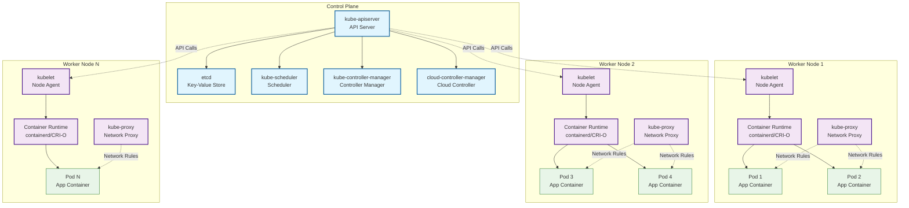

### Week 1: Kubernetes, Docker, Networking, and Security
## Goal: Build a strong foundation in Kubernetes, Docker, scripting, and security basics.

# Daily Breakdown (4-6 hours/day):

# Day 1: Kubernetes Basics (6 hours)
* Learn: Kubernetes architecture (control plane, nodes, pods, services, deployments).
* Resources: Kubernetes docs (kubernetes.io), FreeCodeCamp Kubernetes course (freecodecamp.org).
* Practice: Install Minikube/Kind, deploy an Nginx pod using kubectl apply -f, expose it as a service, and access it.
*  Task: Document kubectl commands in your README.

## Kubernetes Architecture

A Kubernetes cluster consists of two main types of components: the **Control Plane** and the **Worker Nodes**.

### Control Plane

The Control Plane is the brain of the cluster. It manages the overall state of the applications and the cluster itself. Its core components are:

*   **kube-apiserver:** The entry point for all cluster communication. It exposes the Kubernetes API.
*   **etcd:** A consistent and highly-available key-value store that acts as the single source of truth for all cluster data.
*   **kube-scheduler:** Watches for newly created Pods and assigns them to a healthy Worker Node based on resource requirements and other constraints.
*   **kube-controller-manager:** Runs various controller processes that regulate the state of the cluster, ensuring the current state matches the desired state.
*   **cloud-controller-manager:** (Optional) Integrates with the underlying cloud provider's infrastructure for features like load balancers and storage.

### Worker Nodes

Worker Nodes are the machines (virtual or physical) where your containerized applications run. Each worker node contains:

*   **kubelet:** An agent that runs on each node. It communicates with the Control Plane to ensure containers are running in a Pod as specified.
*   **kube-proxy:** A network proxy that runs on each node, maintaining network rules and enabling communication to your Pods from inside or outside the cluster.
*   **Container Runtime:** The software responsible for running containers. Kubernetes supports runtimes like containerd and CRI-O (and formerly Docker).

## Kubernetes Architecture Diagram

### Architecture Components Explained

#### Control Plane Components
- **kube-apiserver**: Central API server that all components communicate with
- **etcd**: Distributed key-value store for cluster state
- **kube-scheduler**: Assigns pods to nodes based on constraints
- **kube-controller-manager**: Runs controllers for different resources
- **cloud-controller-manager**: Integrates with cloud provider APIs

#### Worker Node Components
- **kubelet**: Primary node agent that manages pod lifecycle
- **kube-proxy**: Network proxy for pod-to-pod communication
- **Container Runtime**: Software that runs containers (containerd, CRI-O)

#### Communication Flow
1. **API Server** is the central hub for all cluster communication
2. **etcd** stores the cluster state and configuration
3. **Scheduler** watches for new pods and assigns them to nodes
4. **kubelet** on each node receives pod specifications and manages containers
5. **kube-proxy** handles networking between pods and services

