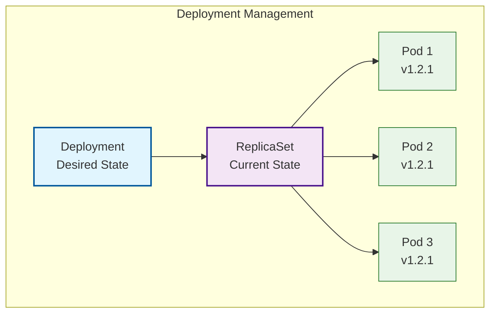

### Week 1: Kubernetes, Docker, Networking, and Security
## Goal: Build a strong foundation in Kubernetes, Docker, scripting, and security basics.

# Daily Breakdown (4-6 hours/day):

# Day 2: Deployments, Services, and Configuration Management (6 hours)
* Learn: Deployments, ReplicaSets, Services, ConfigMaps, and Secrets
* Practice: Create scalable applications with rolling updates
* Task: Deploy a multi-tier application with proper configuration management

## Deployments Overview

Deployments are the recommended way to manage stateless applications in Kubernetes. They provide declarative updates, scaling, and rollback capabilities.

### Deployment Benefits
- **Declarative Updates**: Define desired state, Kubernetes handles the rest
- **Scaling**: Easily scale replicas up or down
- **Rolling Updates**: Zero-downtime application updates
- **Rollback**: Quick rollback to previous versions
- **Self-healing**: Automatically replaces failed pods

## Deployment Architecture



## Essential Commands

### Deployment Management
```bash
# Create deployment
kubectl apply -f deployment.yaml

# Scale deployment
kubectl scale deployment nginx-deployment --replicas=5

# Update deployment image
kubectl set image deployment/nginx-deployment nginx=nginx:1.22.0

# Check rollout status
kubectl rollout status deployment/nginx-deployment

# View rollout history
kubectl rollout history deployment/nginx-deployment

# Rollback deployment
kubectl rollout undo deployment/nginx-deployment

# Pause/Resume rollout
kubectl rollout pause deployment/nginx-deployment
kubectl rollout resume deployment/nginx-deployment
```

### Service Management
```bash
# Create service
kubectl apply -f service.yaml

# List services
kubectl get services

# Describe service
kubectl describe service <service-name>

# Delete service
kubectl delete service <service-name>
```

### ConfigMap Management
```bash
# Create ConfigMap
kubectl create configmap app-config --from-file=config.properties

# Create ConfigMap from literal
kubectl create configmap app-config --from-literal=database_url=postgresql://localhost:5432/mydb

# View ConfigMap
kubectl get configmap <configmap-name> -o yaml

# Delete ConfigMap
kubectl delete configmap <configmap-name>
```

### Secret Management
```bash
# Create secret from literal
kubectl create secret generic db-secret --from-literal=username=myuser --from-literal=password=mypassword

# Create secret from file
kubectl create secret generic tls-secret --from-file=tls.crt --from-file=tls.key

# View secret (decoded)
kubectl get secret <secret-name> -o yaml

# Delete secret
kubectl delete secret <secret-name>
```

## Service Types

| Type | Description | Use Case |
|------|-------------|----------|
| **ClusterIP** | Internal cluster communication | Default service type for internal communication |
| **NodePort** | External access via node IP:port | Development, demos, or when you need external access |
| **LoadBalancer** | Cloud provider load balancer | Production external access with cloud providers |
| **ExternalName** | CNAME record to external service | Access external services using internal DNS |

## Configuration Best Practices

### ConfigMaps
- Use ConfigMaps for non-sensitive configuration data
- Mount as volumes or environment variables
- Separate configuration from application code
- Use different ConfigMaps for different environments

### Secrets
- Never store secrets in plain text
- Use Kubernetes secrets for sensitive data
- Mount secrets as volumes for files
- Use environment variables for simple key-value secrets
- Rotate secrets regularly

## Hands-On Practice Files

The `practice/` directory contains example YAML files for:
- `deployment.yaml` - Nginx deployment with multiple replicas
- `service.yaml` - Different service types (ClusterIP, NodePort)
- `configmap.yaml` - Application configuration examples
- `secret.yaml` - Secret management examples
- `complete-app.yaml` - Multi-tier application deployment

## Daily Tasks Checklist

- [ ] Create and manage Kubernetes Deployments
- [ ] Implement different service types (ClusterIP, NodePort)
- [ ] Practice rolling updates and rollbacks
- [ ] Create and use ConfigMaps for configuration
- [ ] Create and use Secrets for sensitive data
- [ ] Deploy a multi-tier application
- [ ] Practice scaling and debugging commands

## Key Takeaways

1. **Deployments** provide declarative application management with rolling updates
2. **Services** enable communication between pods and external access
3. **ConfigMaps** decouple configuration from container images
4. **Secrets** securely store sensitive information
5. **Scaling** and **updates** should be zero-downtime operations
6. **Resource management** is crucial for production workloads

## Next Steps

After mastering these concepts, you'll be ready to:
- Implement advanced deployment strategies
- Set up proper monitoring and logging
- Configure security policies
- Implement CI/CD pipelines
- Manage stateful applications with StatefulSets