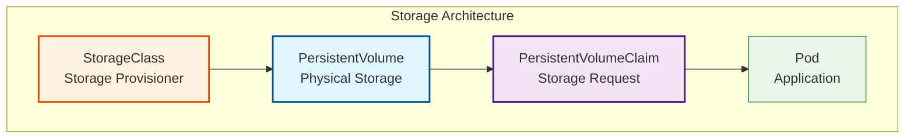

### Week 1: Kubernetes, Docker, Networking, and Security
## Goal: Build a strong foundation in Kubernetes, Docker, scripting, and security basics.

# Daily Breakdown (4-6 hours/day):

# Day 3: StatefulSets, Persistent Storage, and Ingress Controllers (6 hours)
* Learn: StatefulSets for stateful applications and persistent storage
* Practice: Configure PersistentVolumes and PersistentVolumeClaims
* Task: Deploy a stateful application with persistent data
* Master: Ingress controllers for advanced routing and load balancing

## StatefulSets Overview

StatefulSets are used for stateful applications that require persistent storage, stable network identities, and ordered deployment/scaling.

### StatefulSet Use Cases
- **Databases**: MySQL, PostgreSQL, MongoDB clusters
- **Message Queues**: Kafka, RabbitMQ with persistent storage
- **Distributed Storage**: Ceph, GlusterFS clusters
- **Machine Learning**: Stateful training jobs with data persistence
- **Any app requiring**: Stable network IDs, persistent storage, ordered operations

## Storage Architecture



## Essential Commands

### StatefulSet Management
```bash
# Create StatefulSet
kubectl apply -f statefulset.yaml

# Scale StatefulSet
kubectl scale statefulset mysql-statefulset --replicas=5

# Update StatefulSet
kubectl patch statefulset mysql-statefulset -p '{"spec":{"template":{"spec":{"containers":[{"name":"mysql","image":"mysql:8.1"}]}}}}'

# Check StatefulSet status
kubectl rollout status statefulset/mysql-statefulset

# View pods with stable names
kubectl get pods -l app=mysql
```

### Storage Management
```bash
# List storage resources
kubectl get pv,pvc,storageclass

# Describe persistent volume
kubectl describe pv <pv-name>

# Create PersistentVolume
kubectl apply -f persistent-volume.yaml

# Create PersistentVolumeClaim
kubectl apply -f persistent-volume-claim.yaml

# Resize PVC (if supported by storage class)
kubectl patch pvc mysql-pvc -p '{"spec":{"resources":{"requests":{"storage":"10Gi"}}}}'
```

### Ingress Management
```bash
# Install NGINX Ingress Controller
kubectl apply -f https://raw.githubusercontent.com/kubernetes/ingress-nginx/controller-v1.10.1/deploy/static/provider/cloud/deploy.yaml

# Create Ingress resource
kubectl apply -f ingress.yaml

# Get Ingress resources
kubectl get ingress

# Describe Ingress
kubectl describe ingress <ingress-name>

# Check Ingress Controller logs
kubectl logs -n ingress-nginx deployment/ingress-nginx-controller
```

## Storage Components

### PersistentVolumes (PV)
```yaml
apiVersion: v1
kind: PersistentVolume
metadata:
  name: mysql-pv
spec:
  capacity:
    storage: 5Gi
  accessModes:
    - ReadWriteOnce
  hostPath:
    path: /data/mysql
```

### PersistentVolumeClaims (PVC)
```yaml
apiVersion: v1
kind: PersistentVolumeClaim
metadata:
  name: mysql-pvc
spec:
  accessModes:
    - ReadWriteOnce
  resources:
    requests:
      storage: 5Gi
```

### StorageClasses
```yaml
apiVersion: storage.k8s.io/v1
kind: StorageClass
metadata:
  name: fast-ssd
provisioner: kubernetes.io/aws-ebs
parameters:
  type: gp3
  fsType: ext4
```

## Ingress Configuration

### Basic Ingress
```yaml
apiVersion: networking.k8s.io/v1
kind: Ingress
metadata:
  name: example-ingress
spec:
  ingressClassName: nginx
  rules:
  - host: myapp.example.com
    http:
      paths:
      - path: /api
        pathType: Prefix
        backend:
          service:
            name: backend-service
            port:
              number: 80
```

### Ingress with TLS
```yaml
apiVersion: networking.k8s.io/v1
kind: Ingress
metadata:
  name: tls-ingress
spec:
  ingressClassName: nginx
  tls:
  - hosts:
    - myapp.example.com
    secretName: myapp-tls
  rules:
  - host: myapp.example.com
    http:
      paths:
      - path: /
        pathType: Prefix
        backend:
          service:
            name: frontend-service
            port:
              number: 80
```

## StatefulSet Example

```yaml
apiVersion: apps/v1
kind: StatefulSet
metadata:
  name: mysql-statefulset
spec:
  serviceName: mysql-service
  replicas: 3
  selector:
    matchLabels:
      app: mysql
  template:
    metadata:
      labels:
        app: mysql
    spec:
      containers:
      - name: mysql
        image: mysql:8.0
        ports:
        - containerPort: 3306
        env:
        - name: MYSQL_ROOT_PASSWORD
          valueFrom:
            secretKeyRef:
              name: mysql-secret
              key: password
        volumeMounts:
        - name: mysql-data
          mountPath: /var/lib/mysql
  volumeClaimTemplates:
  - metadata:
      name: mysql-data
    spec:
      accessModes: ["ReadWriteOnce"]
      resources:
        requests:
          storage: 5Gi
```

## Access Modes

| Access Mode | Description | Use Case |
|-------------|-------------|----------|
| **ReadWriteOnce (RWO)** | Single node read-write | Most applications, databases |
| **ReadOnlyMany (ROX)** | Multiple nodes read-only | ConfigMaps, static content |
| **ReadWriteMany (RWX)** | Multiple nodes read-write | Shared storage, collaborative apps |
| **ReadWriteOncePod (RWOP)** | Single pod read-write | CSI drivers with pod-level access |

## Ingress Annotations

### NGINX Ingress Controller Annotations
```yaml
metadata:
  annotations:
    nginx.ingress.kubernetes.io/rewrite-target: /
    nginx.ingress.kubernetes.io/ssl-redirect: "true"
    nginx.ingress.kubernetes.io/rate-limit: "100"
    nginx.ingress.kubernetes.io/rate-limit-window: "1m"
    nginx.ingress.kubernetes.io/auth-type: basic
    nginx.ingress.kubernetes.io/auth-secret: basic-auth
    nginx.ingress.kubernetes.io/auth-realm: 'Authentication Required'
```

## Daily Tasks Checklist

- [ ] Create and manage PersistentVolumes and PersistentVolumeClaims
- [ ] Deploy a StatefulSet with persistent storage
- [ ] Install and configure NGINX Ingress Controller
- [ ] Create Ingress resources for traffic routing
- [ ] Configure StorageClasses for dynamic provisioning
- [ ] Test stateful application scaling and updates
- [ ] Practice storage and networking debugging

## Key Takeaways

1. **StatefulSets** provide stable network identities and persistent storage for stateful applications
2. **PersistentVolumes** abstract underlying storage and provide persistent data
3. **StorageClasses** enable dynamic volume provisioning with different storage types
4. **Ingress Controllers** provide advanced load balancing and routing capabilities
5. **Access Modes** determine how storage can be accessed by pods
6. **Volume Claim Templates** in StatefulSets automatically create PVCs for each replica

## Best Practices

### Storage
- Use StorageClasses for dynamic provisioning
- Choose appropriate access modes for your use case
- Implement proper backup strategies for persistent data
- Monitor storage usage and capacity planning
- Use volume snapshots for data protection

### Ingress
- Always use TLS for production traffic
- Implement rate limiting and authentication
- Use Ingress classes to select controllers
- Monitor Ingress controller metrics and logs
- Configure proper health checks for backends

## Next Steps

After mastering these concepts, you'll be ready to:
- Deploy production-grade stateful applications
- Implement advanced networking and security policies
- Set up monitoring and observability
- Implement GitOps and advanced deployment strategies
- Manage multi-cluster Kubernetes deployments