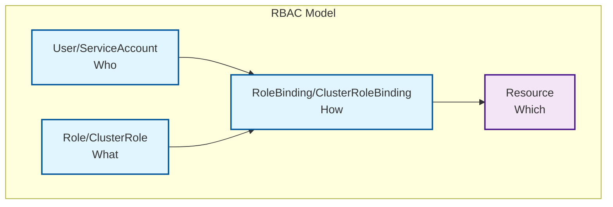

### Week 1: Kubernetes, Docker, Networking, and Security
## Goal: Build a strong foundation in Kubernetes, Docker, scripting, and security basics.

# Daily Breakdown (4-6 hours/day):

# Day 4: Security, Monitoring, and Package Management with Helm (6 hours)
* Learn: RBAC, Network Policies, and Pod Security Standards
* Practice: Set up monitoring with Prometheus and Grafana
* Task: Implement comprehensive security policies
* Master: Helm charts for application packaging and deployment

## Kubernetes Security Architecture

Kubernetes security is implemented through multiple layers: Authentication, Authorization (RBAC), Network Policies, and Pod Security Standards.

### Security Layers
- **Authentication**: Verify identity of users and service accounts
- **Authorization (RBAC)**: Control what authenticated users can do
- **Network Policies**: Control traffic between pods and services
- **Pod Security**: Restrict pod privileges and capabilities
- **Image Security**: Scan and verify container images

## RBAC Components



## Essential Commands

### RBAC Management
```bash
# Create ServiceAccount
kubectl apply -f service-account.yaml

# Create Role with permissions
kubectl apply -f role.yaml

# Bind Role to ServiceAccount
kubectl apply -f rolebinding.yaml

# Check RBAC permissions
kubectl auth can-i get pods --as=system:serviceaccount:production:app-service-account

# List all RBAC resources
kubectl get roles,rolebindings,clusterroles,clusterrolebindings
```

### Security Auditing
```bash
# Check pod security context
kubectl get pod <pod-name> -o yaml | grep -A 10 securityContext

# List network policies
kubectl get networkpolicies

# Check for privileged containers
kubectl get pods -o jsonpath='{range .items[*]}{.metadata.name}{"\t"}{.spec.containers[*].securityContext.privileged}{"\n"}{end}'

# Audit cluster roles
kubectl get clusterroles -o wide

# Check service account permissions
kubectl describe serviceaccount <service-account-name>
```

### Monitoring Setup
```bash
# Install Prometheus stack with Helm
helm repo add prometheus-community https://prometheus-community.github.io/helm-charts
helm repo update
helm install prometheus prometheus-community/kube-prometheus-stack -n monitoring --create-namespace

# Port forward to access Grafana
kubectl port-forward -n monitoring svc/prometheus-grafana 3000:80

# Check monitoring pods
kubectl get pods -n monitoring

# View Prometheus targets
kubectl port-forward -n monitoring svc/prometheus-operated 9090:9090
curl http://localhost:9090/api/v1/targets
```

### Helm Package Management
```bash
# Install Helm
curl -fsSL -o get_helm.sh https://raw.githubusercontent.com/helm/helm/main/scripts/get-helm-3
chmod 700 get_helm.sh
./get_helm.sh

# Create new chart
helm create myapp-chart

# Install chart
helm install myapp ./myapp-chart

# List releases
helm list -A

# Upgrade release
helm upgrade myapp ./myapp-chart

# Rollback release
helm rollback myapp 1

# Uninstall release
helm uninstall myapp
```

## RBAC Examples

### ServiceAccount
```yaml
apiVersion: v1
kind: ServiceAccount
metadata:
  name: app-service-account
  namespace: production
```

### Role Definition
```yaml
apiVersion: rbac.authorization.k8s.io/v1
kind: Role
metadata:
  name: pod-reader
  namespace: production
rules:
- apiGroups: [""]
  resources: ["pods"]
  verbs: ["get", "list", "watch"]
- apiGroups: [""]
  resources: ["pods/log"]
  verbs: ["get"]
```

### RoleBinding
```yaml
apiVersion: rbac.authorization.k8s.io/v1
kind: RoleBinding
metadata:
  name: read-pods
  namespace: production
subjects:
- kind: ServiceAccount
  name: app-service-account
  namespace: production
roleRef:
  kind: Role
  name: pod-reader
  apiGroup: rbac.authorization.k8s.io
```

## Network Policies

### Default Deny Policy
```yaml
apiVersion: networking.k8s.io/v1
kind: NetworkPolicy
metadata:
  name: default-deny-all
  namespace: production
spec:
  podSelector: {}
  policyTypes:
  - Ingress
  - Egress
```

### Allow Specific Traffic
```yaml
apiVersion: networking.k8s.io/v1
kind: NetworkPolicy
metadata:
  name: allow-web-traffic
  namespace: production
spec:
  podSelector:
    matchLabels:
      app: web
  policyTypes:
  - Ingress
  ingress:
  - from:
    - podSelector:
        matchLabels:
          app: frontend
    - namespaceSelector:
        matchLabels:
          name: ingress-nginx
    ports:
    - protocol: TCP
      port: 80
```

## Helm Chart Structure

```
myapp-chart/
├── Chart.yaml          # Chart metadata
├── values.yaml         # Default values
├── charts/             # Dependencies
├── templates/          # Kubernetes manifests
│   ├── deployment.yaml
│   ├── service.yaml
│   ├── ingress.yaml
│   └── _helpers.tpl
└── .helmignore         # Files to ignore
```

### Chart.yaml Example
```yaml
apiVersion: v2
name: myapp-chart
description: A Helm chart for my application
type: application
version: 0.1.0
appVersion: "1.16.0"
```

### values.yaml Example
```yaml
# Default values for myapp-chart
replicaCount: 3

image:
  repository: nginx
  pullPolicy: IfNotPresent
  tag: "1.21.0"

service:
  type: ClusterIP
  port: 80

ingress:
  enabled: true
  className: "nginx"
  hosts:
    - host: myapp.local
      paths:
        - path: /
          pathType: Prefix

resources:
  limits:
    cpu: 500m
    memory: 512Mi
  requests:
    cpu: 250m
    memory: 256Mi
```

## Monitoring Components

### Prometheus Configuration
```yaml
apiVersion: v1
kind: ConfigMap
metadata:
  name: prometheus-config
data:
  prometheus.yml: |
    global:
      scrape_interval: 15s
    scrape_configs:
    - job_name: 'kubernetes-pods'
      kubernetes_sd_configs:
      - role: pod
```

### Grafana Dashboard
```yaml
apiVersion: integreatly.org/v1alpha1
kind: GrafanaDashboard
metadata:
  name: kubernetes-cluster-monitoring
spec:
  json: |
    {
      "dashboard": {
        "title": "Kubernetes Cluster Monitoring",
        "panels": [...]
      }
    }
```

## Security Best Practices

### Pod Security Standards
- **Privileged**: Unrestricted access (avoid in production)
- **Baseline**: Restrictive defaults (recommended minimum)
- **Restricted**: Most restrictive (highest security)

### RBAC Best Practices
- Follow principle of least privilege
- Use specific service accounts for applications
- Regularly audit permissions
- Avoid wildcard permissions in production

### Network Security
- Implement default deny network policies
- Limit external traffic to necessary services only
- Use service mesh for advanced traffic control
- Encrypt traffic between services

## Monitoring Best Practices

### Metrics Collection
- Monitor resource usage (CPU, memory, storage)
- Track application-specific metrics
- Set up proper alerting thresholds
- Use dashboards for different audiences

### Observability
- Implement distributed tracing
- Centralize log aggregation
- Set up proper alerting and escalation
- Monitor Kubernetes cluster health

## Daily Tasks Checklist

- [ ] Implement RBAC with Service Accounts, Roles, and RoleBindings
- [ ] Create and apply Network Policies for traffic control
- [ ] Set up Prometheus and Grafana monitoring stack
- [ ] Configure Pod Security Standards
- [ ] Install and use Helm for package management
- [ ] Create and deploy your first Helm chart
- [ ] Practice security auditing and monitoring queries

## Key Takeaways

1. **RBAC** provides fine-grained access control for Kubernetes resources
2. **Network Policies** control traffic flow between pods and services
3. **Pod Security Standards** define privilege levels for pods
4. **Helm** simplifies application packaging and deployment
5. **Monitoring** is essential for observability and troubleshooting
6. **Security** should be implemented at multiple layers

## Best Practices Summary

### Security
- Implement defense in depth
- Regular security audits and updates
- Least privilege access patterns
- Network segmentation
- Image vulnerability scanning

### Monitoring
- Comprehensive metrics collection
- Meaningful alerting and dashboards
- Log aggregation and analysis
- Performance monitoring and optimization

### Package Management
- Use Helm for complex applications
- Version control your charts
- Implement proper CI/CD for deployments
- Use dependencies wisely

## Next Steps

After mastering these concepts, you'll be ready to:
- Implement enterprise-grade security policies
- Set up comprehensive observability stacks
- Manage complex applications with Helm
- Implement GitOps workflows
- Scale Kubernetes clusters effectively