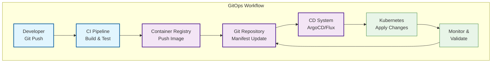

### Week 1: Kubernetes, Docker, Networking, and Security
## Goal: Build a strong foundation in Kubernetes, Docker, scripting, and security basics.

# Daily Breakdown (4-6 hours/day):

# Day 5: CI/CD Integration, GitOps, and Advanced Deployment Strategies (6 hours)
* Learn: CI/CD pipeline integration with Kubernetes
* Practice: GitOps workflows with ArgoCD and Flux
* Task: Implement automated deployment strategies
* Master: Advanced deployment patterns (Canary, Blue-Green)

## CI/CD Pipeline Architecture

Modern CI/CD pipelines integrate seamlessly with Kubernetes to provide automated, reliable deployments with proper testing and validation.

### Pipeline Stages
- **Source Control**: Code commit triggers pipeline
- **Build & Test**: Compile, test, and validate code
- **Container Build**: Create and push container images
- **Security Scanning**: Scan images for vulnerabilities
- **Deploy**: Deploy to Kubernetes clusters
- **Verification**: Test deployment and functionality

## GitOps Workflow



## Essential Commands

### GitHub Actions CI/CD
```bash
# Create workflow file
mkdir -p .github/workflows

# Set up kubectl context
export KUBECONFIG=$HOME/.kube/config

# Update image tag in deployment
sed -i "s|IMAGE_TAG|$NEW_TAG|g" k8s/deployment.yaml

# Apply Kubernetes manifests
kubectl apply -f k8s/

# Check rollout status
kubectl rollout status deployment/myapp
```

### ArgoCD GitOps
```bash
# Install ArgoCD
kubectl create namespace argocd
kubectl apply -n argocd -f https://raw.githubusercontent.com/argoproj/argo-cd/stable/manifests/install.yaml

# Get initial admin password
kubectl -n argocd get secret argocd-initial-admin-secret -o jsonpath="{.data.password}" | base64 -d

# Create ArgoCD application
argocd app create myapp \
  --repo https://github.com/myorg/manifests \
  --path k8s \
  --dest-server https://kubernetes.default.svc \
  --dest-namespace default

# Sync application
argocd app sync myapp

# Check application health
argocd app get myapp
```

### Advanced Deployment Commands
```bash
# Argo Rollouts for canary deployments
kubectl argo rollouts promote myapp-canary
kubectl argo rollouts get rollout myapp-canary
kubectl argo rollouts abort myapp-canary

# Blue-Green deployment switching
kubectl scale deployment myapp-blue --replicas=0
kubectl scale deployment myapp-green --replicas=3
kubectl patch svc myapp-service -p '{"spec":{"selector":{"version":"green"}}}'

# Flux GitOps commands
flux bootstrap github --owner=myorg --repository=manifests --path=k8s
flux reconcile kustomization myapp
flux suspend kustomization myapp
```

## GitHub Actions Workflow Example

```yaml
name: CI/CD Pipeline

on:
  push:
    branches: [main]
  pull_request:
    branches: [main]

jobs:
  build-and-deploy:
    runs-on: ubuntu-latest

    steps:
    - uses: actions/checkout@v3

    - name: Set up Docker Buildx
      uses: docker/setup-buildx-action@v2

    - name: Log in to Container Registry
      uses: docker/login-action@v2
      with:
        registry: ${{ secrets.REGISTRY_URL }}
        username: ${{ secrets.REGISTRY_USERNAME }}
        password: ${{ secrets.REGISTRY_PASSWORD }}

    - name: Build and push Docker image
      uses: docker/build-push-action@v4
      with:
        context: .
        push: true
        tags: ${{ secrets.REGISTRY_URL }}/myapp:${{ github.sha }}

    - name: Configure kubectl
      uses: azure/k8s-set-context@v3
      with:
        kubeconfig: ${{ secrets.KUBE_CONFIG }}

    - name: Deploy to Kubernetes
      run: |
        sed -i "s|IMAGE_TAG|${{ secrets.REGISTRY_URL }}/myapp:${{ github.sha }}|g" k8s/deployment.yaml
        kubectl apply -f k8s/
        kubectl rollout status deployment/myapp
```

## ArgoCD Application Manifest

```yaml
apiVersion: argoproj.io/v1alpha1
kind: Application
metadata:
  name: myapp-production
  namespace: argocd
spec:
  project: default
  source:
    repoURL: https://github.com/myorg/manifests
    targetRevision: HEAD
    path: k8s/overlays/production
  destination:
    server: https://kubernetes.default.svc
    namespace: production
  syncPolicy:
    automated:
      prune: true
      selfHeal: true
      allowEmpty: false
    syncOptions:
      - CreateNamespace=true
      - PrunePropagationPolicy=foreground
      - PruneLast=true
    retry:
      limit: 5
      backoff:
        duration: 5s
        factor: 2
        maxDuration: 3m
```

## Canary Deployment with Argo Rollouts

```yaml
apiVersion: argoproj.io/v1alpha1
kind: Rollout
metadata:
  name: myapp-canary
spec:
  replicas: 10
  strategy:
    canary:
      stableService: myapp-stable
      canaryService: myapp-canary
      steps:
      - setWeight: 10
      - pause: {}
      - setWeight: 50
      - pause: {duration: 60}
      - setWeight: 100
  selector:
    matchLabels:
      app: myapp
  template:
    metadata:
      labels:
        app: myapp
    spec:
      containers:
      - name: myapp
        image: myapp:v1.0.0
        ports:
        - containerPort: 8080
```

## Blue-Green Deployment Setup

```yaml
# Blue Environment
apiVersion: apps/v1
kind: Deployment
metadata:
  name: myapp-blue
spec:
  replicas: 3
  selector:
    matchLabels:
      app: myapp
      version: blue
  template:
    metadata:
      labels:
        app: myapp
        version: blue
    spec:
      containers:
      - name: myapp
        image: myapp:v1.0.0
        ports:
        - containerPort: 8080

---
# Green Environment (new version)
apiVersion: apps/v1
kind: Deployment
metadata:
  name: myapp-green
spec:
  replicas: 0  # Start with 0 replicas
  selector:
    matchLabels:
      app: myapp
      version: green
  template:
    metadata:
      labels:
        app: myapp
        version: green
    spec:
      containers:
      - name: myapp
        image: myapp:v1.1.0
        ports:
        - containerPort: 8080

---
# Service that switches between blue and green
apiVersion: v1
kind: Service
metadata:
  name: myapp-service
spec:
  type: ClusterIP
  selector:
    app: myapp
    version: blue  # Change to green when ready
  ports:
  - port: 80
    targetPort: 8080
```

## Flux GitOps Configuration

```yaml
# Flux Kustomization for automated sync
apiVersion: kustomize.toolkit.fluxcd.io/v1
kind: Kustomization
metadata:
  name: myapp-production
  namespace: flux-system
spec:
  interval: 10m0s
  retryInterval: 2m0s
  timeout: 5m0s
  sourceRef:
    kind: GitRepository
    name: myapp-manifests
  path: ./k8s/overlays/production
  prune: true
  validation: client
  healthChecks:
  - apiVersion: apps/v1
    kind: Deployment
    name: myapp
    namespace: production
```

## Multi-Environment Strategy

### Environment Structure
```
repository/
├── k8s/
│   ├── base/                    # Base manifests
│   │   ├── deployment.yaml
│   │   ├── service.yaml
│   │   └── kustomization.yaml
│   ├── overlays/
│   │   ├── development/
│   │   ├── staging/
│   │   └── production/
│   └── applications/
│       ├── app1/
│       ├── app2/
│       └── app3/
```

### Kustomization Example
```yaml
# k8s/base/kustomization.yaml
apiVersion: kustomize.config.k8s.io/v1beta1
kind: Kustomization

resources:
  - deployment.yaml
  - service.yaml

commonLabels:
  app: myapp
  environment: base

images:
  - name: myapp
    newTag: v1.0.0

replicas:
  - name: myapp
    count: 3
```

```yaml
# k8s/overlays/production/kustomization.yaml
apiVersion: kustomize.config.k8s.io/v1beta1
kind: Kustomization

bases:
  - ../../base

patchesStrategicMerge:
  - deployment-patch.yaml

images:
  - name: myapp
    newTag: v1.2.0

replicas:
  - name: myapp
    count: 10

patchesStrategicMerge:
  - |-
    apiVersion: apps/v1
    kind: Deployment
    metadata:
      name: myapp
    spec:
      template:
        spec:
          containers:
          - name: myapp
            env:
            - name: ENVIRONMENT
              value: production
```

## Deployment Strategy Comparison

| Strategy | Pros | Cons | Use Case |
|----------|------|------|----------|
| **Rolling Update** | Zero downtime, gradual | Slower, complex rollback | Most applications |
| **Recreate** | Fast, simple | Downtime | Non-critical apps |
| **Canary** | Low risk, data-driven | Complex setup | High-traffic apps |
| **Blue-Green** | Instant rollback, isolated | Resource intensive | Critical applications |
| **GitOps** | Declarative, auditable | Learning curve | Infrastructure teams |

## Best Practices

### CI/CD Pipeline
- **Automated Testing**: Unit, integration, and E2E tests
- **Security Scanning**: Image vulnerability scanning
- **Artifact Management**: Proper versioning and immutability
- **Environment Promotion**: Consistent promotion across environments
- **Rollback Procedures**: Automated rollback capabilities

### GitOps
- **Single Source of Truth**: All configuration in Git
- **Automated Reconciliation**: Continuous sync between desired and actual state
- **Branch Protection**: Proper review processes for main branches
- **Gradual Rollouts**: Use canary deployments for risky changes
- **Disaster Recovery**: Git history provides complete audit trail

### Advanced Deployments
- **Health Checks**: Proper readiness and liveness probes
- **Resource Management**: Appropriate resource requests and limits
- **Monitoring Integration**: Metrics collection and alerting
- **Database Migrations**: Proper handling of schema changes
- **Feature Flags**: Enable/disable features without deployments

## Daily Tasks Checklist

- [ ] Set up GitHub Actions CI/CD pipeline
- [ ] Install and configure ArgoCD for GitOps
- [ ] Create automated deployment workflows
- [ ] Implement canary deployment strategy
- [ ] Set up blue-green deployment pattern
- [ ] Configure multi-environment deployments
- [ ] Practice rollback and recovery procedures

## Key Takeaways

1. **CI/CD** automates the software delivery lifecycle from code commit to production deployment
2. **GitOps** uses Git as the single source of truth for infrastructure and application configuration
3. **Canary Deployments** allow gradual rollout of new versions with risk mitigation
4. **Blue-Green Deployments** provide instant rollback capabilities with isolated environments
5. **Multi-environment Management** ensures consistency across development, staging, and production
6. **Automation** reduces human error and increases deployment frequency and reliability

## Next Steps

After mastering these concepts, you'll be ready to:
- Implement enterprise CI/CD pipelines
- Manage complex GitOps workflows
- Handle advanced deployment scenarios
- Scale deployment processes across teams
- Implement DevSecOps practices
- Manage multi-cluster deployments effectively