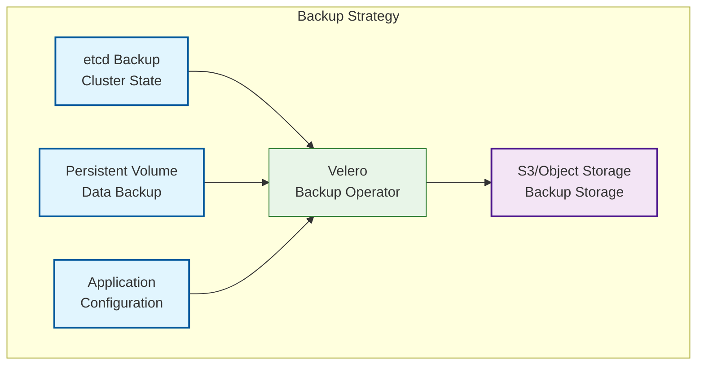

### Week 1: Kubernetes, Docker, Networking, and Security
## Goal: Build a strong foundation in Kubernetes, Docker, scripting, and security basics.

# Daily Breakdown (4-6 hours/day):

# Day 6: Multi-Cluster Management and Production Operations (6 hours)
* Learn: Multi-cluster architectures and federation
* Practice: Backup and disaster recovery with Velero
* Task: Implement performance optimization strategies
* Master: Production operations and troubleshooting

## Multi-Cluster Architecture

Multi-cluster architectures provide high availability, disaster recovery, and geographic distribution of applications.

### Cluster Types
- **Primary Clusters**: Main production workloads
- **Secondary Clusters**: Failover and disaster recovery
- **Edge Clusters**: Low-latency regional access
- **Development Clusters**: Testing and staging environments
- **Specialized Clusters**: GPU, high-memory, or compliance-specific

## Backup & Disaster Recovery Strategy



## Essential Commands

### Multi-Cluster Management
```bash
# Switch between cluster contexts
kubectl config use-context cluster-1
kubectl config use-context cluster-2

# View all contexts
kubectl config get-contexts

# Copy resources between clusters
kubectl get deployment myapp -o yaml | kubectl apply -f -

# Check cluster federation
kubectl get kubefedclusters

# View cluster information
kubectl cluster-info
```

### Backup & Recovery
```bash
# Install Velero
velero install \
  --provider aws \
  --plugins velero/velero-plugin-for-aws:v1.8.0 \
  --bucket my-bucket \
  --backup-location-config region=us-east-1 \
  --snapshot-location-config region=us-east-1

# Create backup
velero backup create production-backup --include-namespaces production,monitoring

# List backups
velero backup get

# Restore from backup
velero restore create --from-backup production-backup

# Schedule automated backups
velero schedule create production-daily --schedule="0 2 * * *"
```

### Performance Optimization
```bash
# Install metrics server
kubectl apply -f https://github.com/kubernetes-sigs/metrics-server/releases/latest/download/components.yaml

# Check resource utilization
kubectl top nodes
kubectl top pods --all-namespaces

# Monitor cluster performance
kubectl get --raw /metrics | grep -E "(cpu|memory)"

# Check storage performance
kubectl exec -it <pod-name> -- iostat -x 1 5

# Network performance testing
kubectl run netperf --image=networkstatic/netperf --rm -it
```

### Production Operations
```bash
# Cluster health checks
kubectl get componentstatuses
kubectl get nodes
kubectl get pods --all-namespaces -o wide

# Node maintenance
kubectl drain <node-name> --ignore-daemonsets --delete-emptydir-data
kubectl cordon <node-name>
kubectl uncordon <node-name>

# Certificate management
sudo kubeadm certs renew all
sudo systemctl restart kubelet

# Resource quota management
kubectl describe resourcequota
kubectl describe limitrange
```

## Velero Backup Configuration

### Backup Custom Resource
```yaml
apiVersion: velero.io/v1
kind: Backup
metadata:
  name: production-backup
  namespace: velero
spec:
  includedNamespaces:
  - production
  - monitoring
  - logging
  excludedResources:
  - nodes
  - events
  - secrets  # Exclude sensitive data if needed
  storageLocation: default
  volumeSnapshotLocations:
  - default
  ttl: 720h  # 30 days
```

### Backup Schedule
```yaml
apiVersion: velero.io/v1
kind: Schedule
metadata:
  name: production-daily
  namespace: velero
spec:
  schedule: "0 2 * * *"
  template:
    includedNamespaces:
    - production
    - monitoring
    storageLocation: default
    ttl: 720h
```

### Restore Configuration
```yaml
apiVersion: velero.io/v1
kind: Restore
metadata:
  name: production-restore
  namespace: velero
spec:
  backupName: production-backup
  includedNamespaces:
  - production
  - monitoring
  restorePVs: true
  preserveNodePorts: true
```

## Performance Optimization Strategies

### Resource Management
```yaml
# Resource Quota for namespace
apiVersion: v1
kind: ResourceQuota
metadata:
  name: production-quota
  namespace: production
spec:
  hard:
    requests.cpu: "4"
    requests.memory: 8Gi
    limits.cpu: "8"
    limits.memory: 16Gi
    persistentvolumeclaims: "10"
    pods: "20"
    services: "10"
    secrets: "20"
    configmaps: "20"
```

### LimitRange for default limits
```yaml
apiVersion: v1
kind: LimitRange
metadata:
  name: resource-limits
  namespace: production
spec:
  limits:
  - type: Container
    default:
      cpu: 100m
      memory: 128Mi
    defaultRequest:
      cpu: 50m
      memory: 64Mi
    max:
      cpu: 1000m
      memory: 2Gi
    min:
      cpu: 10m
      memory: 16Mi
```

## Cost Optimization Tools

### Kubecost Installation
```bash
# Install Kubecost for cost monitoring
helm repo add kubecost https://kubecost.github.io/cost-analyzer/
helm install kubecost kubecost/cost-analyzer \
  --namespace kubecost \
  --create-namespace \
  --set kubecostToken="your-token-here"
```

### Goldilocks for Resource Recommendations
```bash
# Install Goldilocks
helm repo add fairwinds-stable https://charts.fairwinds.com/stable
helm install goldilocks fairwinds-stable/goldilocks \
  --namespace goldilocks \
  --create-namespace
```

## Cluster Federation

### KubeFed Configuration
```yaml
# KubeFed cluster registration
apiVersion: core.kubefed.io/v1beta1
kind: KubeFedCluster
metadata:
  name: cluster-2
spec:
  apiEndpoint: https://cluster-2-api.example.com
  secretRef:
    name: cluster-2-secret
  disabledTLSValidations: false
```

### Federated Deployment
```yaml
apiVersion: types.kubefed.io/v1beta1
kind: FederatedDeployment
metadata:
  name: myapp-federated
  namespace: default
spec:
  template:
    metadata:
      labels:
        app: myapp
    spec:
      replicas: 3
      selector:
        matchLabels:
          app: myapp
      template:
        metadata:
          labels:
            app: myapp
        spec:
          containers:
          - name: myapp
            image: myapp:v1.0.0
  placement:
    clusters:
    - name: cluster-1
    - name: cluster-2
  overrides:
  - clusterName: cluster-1
    clusterOverrides:
    - path: spec.replicas
      value: 5
```

## Troubleshooting Commands

### Cluster Health
```bash
# Check cluster components
kubectl get componentstatuses

# Verify node conditions
kubectl describe nodes | grep -A 5 "Conditions"

# Check API server health
kubectl get --raw /healthz

# Verify DNS resolution
kubectl run test-dns --image=busybox:1.28 --rm -it --restart=Never -- nslookup kubernetes.default
```

### Application Debugging
```bash
# Check pod events
kubectl get events --sort-by=.metadata.creationTimestamp

# View logs from multiple pods
kubectl logs -l app=myapp --tail=100 -f

# Debug network connectivity
kubectl exec -it <pod-name> -- wget -O- http://<service-name>

# Check resource constraints
kubectl describe pod <pod-name> | grep -A 10 "Events"
```

### Storage Troubleshooting
```bash
# Check PVC status
kubectl get pvc -A

# Describe PV issues
kubectl describe pv <pv-name>

# Check storage class
kubectl get storageclass

# Verify volume mounts
kubectl exec -it <pod-name> -- mount | grep <volume-name>
```

## Production Operations Checklist

### Daily Operations
- [ ] Check cluster health and component status
- [ ] Review resource utilization and capacity
- [ ] Monitor application performance and errors
- [ ] Verify backup completion and test restores
- [ ] Check security events and audit logs

### Weekly Operations
- [ ] Review and optimize resource usage
- [ ] Update cluster components and security patches
- [ ] Test disaster recovery procedures
- [ ] Analyze cost trends and optimization opportunities
- [ ] Review and update documentation

### Monthly Operations
- [ ] Perform full cluster backup and restore test
- [ ] Review and update security policies
- [ ] Capacity planning and resource forecasting
- [ ] Update dependencies and base images
- [ ] Team training and knowledge sharing

## Best Practices

### Multi-Cluster Management
- **Consistent Configuration**: Use GitOps across all clusters
- **Centralized Monitoring**: Single pane of glass for all clusters
- **Automated Failover**: Implement proper disaster recovery
- **Security Consistency**: Unified security policies across clusters
- **Resource Optimization**: Right-size clusters for workload requirements

### Production Operations
- **Regular Backups**: Automated backup schedules and testing
- **Performance Monitoring**: Proactive monitoring and alerting
- **Security Updates**: Regular patch management and updates
- **Capacity Planning**: Monitor growth and plan accordingly
- **Incident Response**: Documented procedures and runbooks

### Cost Optimization
- **Resource Efficiency**: Right-size deployments and eliminate waste
- **Storage Optimization**: Use appropriate storage classes and lifecycle policies
- **Node Optimization**: Choose optimal instance types and sizes
- **Monitoring Costs**: Track and optimize monitoring overhead
- **Scheduled Scaling**: Use appropriate scaling strategies

## Key Takeaways

1. **Multi-Cluster Architecture** provides high availability and disaster recovery capabilities
2. **Velero** enables comprehensive backup and restore of Kubernetes resources
3. **Performance Optimization** requires continuous monitoring and right-sizing
4. **Cost Management** involves tracking usage and eliminating waste
5. **Production Operations** require systematic maintenance and troubleshooting
6. **Disaster Recovery** must be tested regularly and automated where possible

## Next Steps

After mastering these concepts, you'll be ready to:
- Design and manage enterprise multi-cluster architectures
- Implement comprehensive backup and disaster recovery strategies
- Optimize cluster performance and costs at scale
- Handle complex production operations and incidents
- Lead DevOps and SRE initiatives in Kubernetes environments
- Architect highly available and scalable platforms

## Final Week 1 Summary

Congratulations on completing Week 1! You now have a comprehensive foundation in:
- ✅ Kubernetes fundamentals and architecture
- ✅ Application deployment and management
- ✅ Stateful applications and persistent storage
- ✅ Security, monitoring, and package management
- ✅ CI/CD pipelines and GitOps workflows
- ✅ Multi-cluster management and production operations

This foundation prepares you for advanced topics like service mesh, serverless computing, and cloud-native architecture patterns in future weeks.